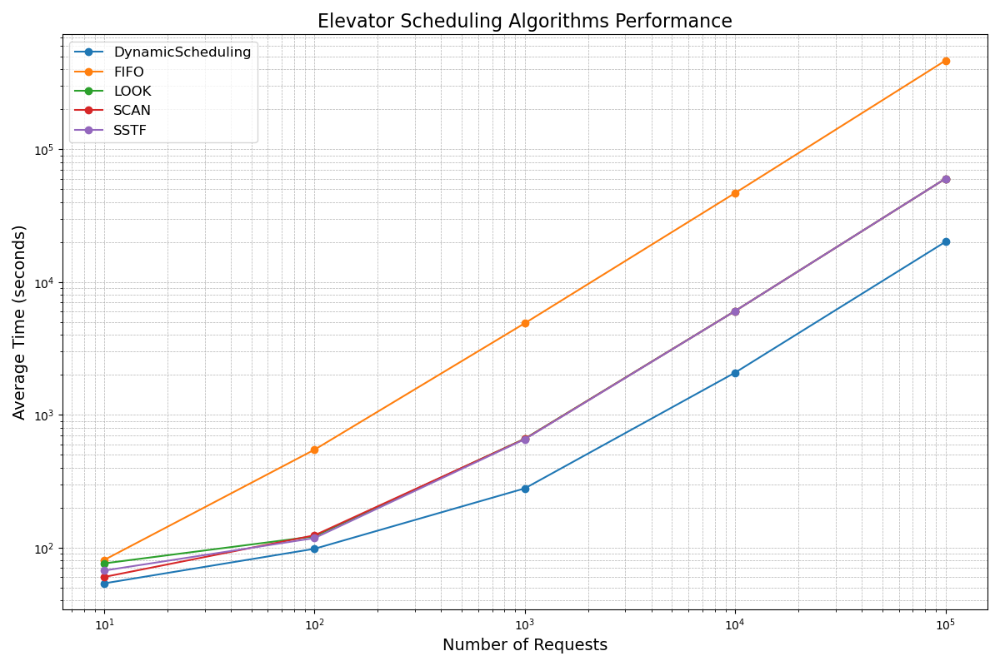

# Elevator Problem [](https://github.com/emomaxd/elevator-problem/blob/master/LICENSE)

The **Elevator Problem** is a classic optimization problem that revolves around designing an efficient strategy for an elevator to handle passenger requests across multiple floors. It draws parallels with scheduling challenges in computer science, such as disk scheduling and resource allocation.

---


## **Problem Overview**
Imagine a building equipped with an elevator:
- The elevator starts at a specific floor.
- Passengers want to board from various floors and travel to their desired destinations.
- The goal is to determine the most efficient strategy to minimize travel time, waiting time, or energy consumption.

The challenge is to strike a balance between **efficiency** and **fairness** while ensuring all requests are handled.

---

## **Real-Life Applications**

The Elevator Problem has applications in:
1. **Operating Systems**:
   - Disk scheduling algorithms like SCAN and SSTF.
2. **Real-Time Systems**:
   - Industrial automation and robotic movement.
3. **Networking**:
   - Packet scheduling and resource allocation.
4. **Building Management Systems**:
   - Intelligent elevator control systems for high-rise buildings.

---
## **What’s Included?**

1. **Profiler Code (C++):**
   - Simulates various elevator scheduling algorithms.
   - Outputs results into a file named `results.json`.

2. **Visualizer Code (Python):**
   - Reads the JSON output from the profiler.
   - Creates and saves a graph as `results_plot.png` using Matplotlib.

3. **Dependencies:**
   - **C++**:
     - [nlohmann/json](https://github.com/nlohmann/json) – A single-header JSON library for parsing and manipulating JSON files.
   - **Python**:
     - `matplotlib` for visualization.
     - `json` for parsing the profiler output.

4. **Other Goodies:**
   - **[Optimizing Vertical Transportation: A Comparative Study of Elevator Dispatching Algorithms in Dynamic Environments](./resources/Article.pdf)** – For a more detailed discussion, refer to our research article.
   - **[JSON Output](./results/results.json)** – The profiler's output.
   - **[Graph Output](./results/results_plot.png)** – The visual representation of the data.

---

## **Solution Approaches**
Several algorithms can solve the Elevator Problem, each with unique trade-offs:

### 1. **FIFO (First In, First Out)**
- Passengers are served in the order they request the elevator.
- **Pros**: Simple and easy to implement.
- **Cons**: High waiting times for distant requests.

#### Code Sample (C++)
```cpp
void fifo(std::queue<int> requests) {
    while (!requests.empty()) {
        int current = requests.front();
        requests.pop();
        std::cout << "Stopping at floor: " << current << std::endl;
    }
}
```

### 2. **SCAN (Elevator Algorithm)**
- The elevator moves in one direction until the end, then reverses.
- **Pros**: Provides fairness by visiting all floors in order.
- **Cons**: Can lead to longer travel times for intermediate requests.

#### Code Sample (C++)
```cpp
void scan(std::vector<int>& floors, int start) {
    std::sort(floors.begin(), floors.end());
    for (int floor : floors) {
        if (floor >= start) std::cout << "Stopping at floor: " << floor << std::endl;
    }
    for (auto it = floors.rbegin(); it != floors.rend(); ++it) {
        if (*it < start) std::cout << "Stopping at floor: " << *it << std::endl;
    }
}
```

### 3. **LOOK (Optimized SCAN)**
- Similar to SCAN but stops at the last requested floor in each direction.
- **Pros**: Reduces unnecessary movement, saving energy and time.
- **Cons**: May still delay distant requests.

#### Code Sample (C++)
```cpp
void look(std::vector<int>& floors, int start) {
    std::sort(floors.begin(), floors.end());
    auto pivot = std::lower_bound(floors.begin(), floors.end(), start);
    for (auto it = pivot; it != floors.end(); ++it) {
        std::cout << "Stopping at floor: " << *it << std::endl;
    }
    for (auto it = std::make_reverse_iterator(pivot); it != floors.rend(); ++it) {
        std::cout << "Stopping at floor: " << *it << std::endl;
    }
}
```

### 4. **SSTF (Shortest Seek Time First)**
- The elevator serves the nearest request first.
- **Pros**: Minimizes immediate travel time.
- **Cons**: Can cause starvation for distant requests.

#### Code Sample (C++)
```cpp
void sstf(std::vector<int> floors, int start) {
    while (!floors.empty()) {
        auto closest = std::min_element(floors.begin(), floors.end(), [start](int a, int b) {
            return std::abs(a - start) < std::abs(b - start);
        });
        std::cout << "Stopping at floor: " << *closest << std::endl;
        start = *closest;
        floors.erase(closest);
    }
}
```

### 5. **Dynamic Scheduling**
- Adjusts the elevator's path dynamically based on real-time requests.
- **Pros**: Adapts to changing conditions and offers optimal performance.
- **Cons**: Computationally expensive and complex to implement.

#### Code Sample (C++)
```cpp
void dynamicScheduling(std::multiset<int>& requests, int start) {
    while (!requests.empty()) {
        auto closest = requests.lower_bound(start);
        if (closest == requests.end()) closest = requests.begin();
        std::cout << "Stopping at floor: " << *closest << std::endl;
        start = *closest;
        requests.erase(closest);
    }
}
```

---

## **Performance Considerations**
When designing an elevator scheduling algorithm, consider:
- **Response Time**: Minimize the time passengers wait.
- **Energy Efficiency**: Avoid unnecessary movements.
- **Fairness**: Ensure all requests are eventually handled.
- **Scalability**: Maintain performance as the number of floors or passengers increases.

---

## **How to Run the Code**

### Running the Profiler (C++):
1. Compile and run the code:
   ```bash
   g++ profiler.cpp -o profiler
   ./profiler
   ```

### Running the Visualizer (Python):  
1. Install required libraries:  
   ```bash
   pip install matplotlib
   ```
3. Run the visualizer:  
   ```bash
   python3 visualizer.py
   ```

---

## **Output Highlights**

- The **JSON Output** (`results.json`) contains raw performance data of the algorithms.
- The **Graph Output** (`results_plot.png`) visually illustrates the performance metrics for easy comparison.
  
  

---